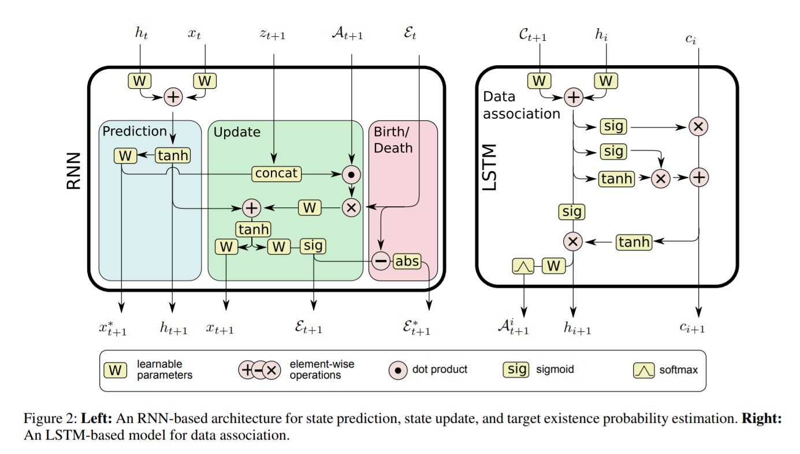

# OnLine Multi-Target Tracking Using Recurrent Neural Networks

论文链接：[https://arxiv.org/pdf/1604.03635.pdf](https://arxiv.org/pdf/1604.03635.pdf)

代码链接：[https://bitbucket.org/amilan/rnntracking](https://bitbucket.org/amilan/rnntracking)

## 概要

作者提出使用RNN做端到端的在线多目标跟踪，多目标跟踪的挑战有三点：

>* 目标数量的不确定性，目标可能会无规律的消失和出现
>* 对各个目标的位置进行连续的预测
>* 目标与预测点的分配问题

作者提出的模型创新点在于：

>* 是第一个使用RNN做多目标跟踪的模型。模型虽然精度不是非常的突出，但是速度快。
>* 作者使用RNN实现了预测和分配的一整套的多目标跟踪的任务。模型是“model-free”的它不需要知道目标运动规律的先验知识。模型可以很好的捕获线性和非线性运动以及一些高阶的运动关系。
>* 模型可以通过训练学习到如何处理物体消失和出现的情况。以解决分配和关联目标路径的难题。这是因为模型不仅可以通过规整过的输入输出数据对序列进行预测也可以通过不规则的数据集进行相关的处理。
>* 作者提出了一种从生成模型中抽样来生成任意数量的训练样本的方法。

作者使用的数据集是[*2D MOT2015*](https://motchallenge.net/data/2D_MOT_2015/)

    

## 主要思想

    

### 1.跟踪状态更新问题

作者使用LSTM网络作为预测物体运动的网络，LSTM可以选择性的保留之前的状态信息，作者利用这一特性实现了物体消失和物体出现的状态更新操作。

    
     
    

其中$f$是忘记门的输出，忘记门的输出和输入都是一个$n$维的向量。$h_t^l$是第$l$个LSTM层的$t$时刻的隐藏层状态。$\odot$表示各个元素相乘。其中的$i,o,f$是通过一个sigmoid函数得到：

    

### 2.跟踪器模块

跟踪模块主要分为三个部分：

- prediction：学习一个复杂的模型，用于在没有测量值的情况下预测目标的运动状态。
- Update：在给定target-to-measurement的情况下，学习如何纠正状态分布
- Brith/death：学习根据状态，观测数据和路径分配结果识别路径的开始和结束。

首先预测部分会对$x_t$进行预测得到$x_{t+1}^*$，当$A_{t+1}$(data association)可用时对预测状态进行更新，得到最终跟踪结果$x_{t+1}$，并且计算出后来帧的每个target的后续存在的可能性$\varepsilon_{t+1}$

loss:由于将MOTA作为loss函数会带来很多的计算上的问题有可能导致模型无法收敛，所以作者提出了自己的loss函数。最小化预测的状态和更新后的状态以及ground truth之间的均方误差。

    

对于跟踪目标的出现和消失问题，作者使用可变长的向量$\varepsilon\in(0,1)^N$，该$N$维向量表示每个target在当前帧存在的可能性。通过使用交叉熵损失来计算这部分与ground truth的loss。

    

在跟踪过程中物体会由于遮挡使得在当前帧的存在的可能性降低，这会导致一旦物体发生遮挡模型就认为该物体消失了该物体的跟踪路径也将随之结束，所以作者希望能够让可能性随时间的变化尽量平滑。作者通过最小化两帧的$\varepsilon$的差值的绝对值来达到平滑的效果。

    

### 3.分配模块（Data Association with LSTMs）

主要思想是利用LSTM的时间分步功能，预测每一个target的assignment，每一次预测一个target。$C_{t+1}$是每一个预测状态$x$特征和每一个观测状态$z$特征的距离矩阵。其中的特征包含外观特征和其他的相似性特征。$C_{ij}=||x^i-z^j||_2$

**loss**：作者使用负对数似然loss函数计算误分配cost

    

$\tilde{a}$表示正确的分配

## 实验

    

